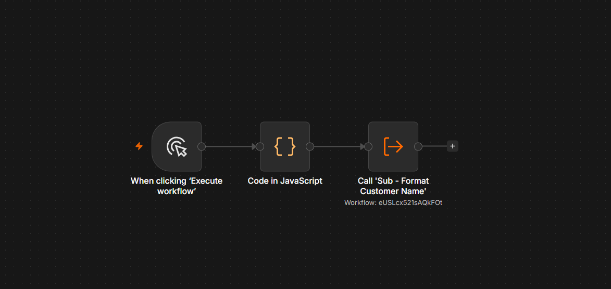
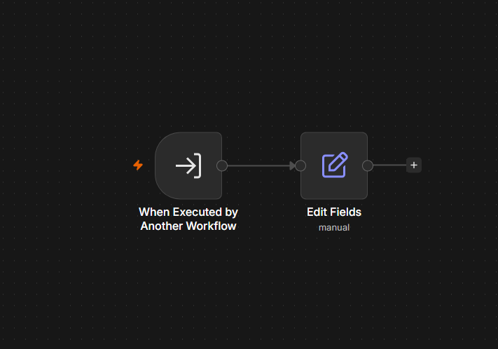

# 06 — Sub-workflows (Execute Workflow Node)

## ⚠️ Before you look at workflow.json
Try building this yourself first from the instructions below. Only open `workflow.json` afterward to verify.

## Goal
Learn to build reusable logic once and call it from other workflows — like a function — instead of copy-pasting the same nodes everywhere.

## Concepts covered
- **Execute Workflow Trigger** node (marks a workflow as callable by others)
- **Execute Workflow** node (calls another workflow and passes data into it)
- Data passed into a sub-workflow arrives as its input `$json`, same as any normal trigger
- Sub-workflow's output returns to the caller as if it were a regular node's output

## Workflow structure

**Sub-workflow: `Sub - Format Customer Name`**
```
Execute Workflow Trigger → Edit Fields (formattedName: {{ $json.firstName.trim() }} {{ $json.lastName.trim() }})
```

**Main workflow:**
```
When clicking 'Execute workflow' → Code in JavaScript → Execute Workflow (calls "Sub - Format Customer Name")
```

## Code node content (main workflow)
```javascript
return [
  { json: { firstName: "  ali ", lastName: " khan  " } }
];
```

## Execute Workflow node settings
- **Source:** Database
- **Workflow:** From list → `Sub - Format Customer Name`
- **Mode:** Run once with all items

## Expected output
```json
{ "formattedName": "ali khan" }
```

## Screenshot



## What I learned / notes
- Sub-workflows behave like functions: same reusable logic, callable from multiple main workflows
- This is the pattern used a lot professionally — e.g. one "Format Customer Name" or "Send Slack Alert" sub-workflow reused across a dozen client automations
- The Execute Workflow node's output panel even shows "View sub-execution" — useful for debugging what happened inside the sub-workflow specifically

## Status
✅ Completed — output: `formattedName: "ali khan"` — [Date: 6 July 2026]
