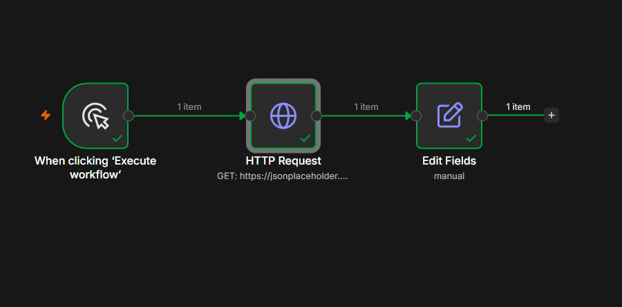

# 08 — HTTP Request Node (GET a public API)

## ⚠️ Before you look at workflow.json
Try building this yourself first from the instructions below. Only open `workflow.json` afterward to verify.

## Goal
Learn to call an external API using the generic **HTTP Request** node — the single most-used node in real-world n8n automations, since it works with any API even without a dedicated n8n integration node.

## Concepts covered
- HTTP Request node in GET mode
- Reading a real API's JSON response as `$json`
- Referencing **nested fields** in expressions (e.g. `$json.company.name`)

## Workflow structure
```
Manual Trigger → HTTP Request (GET) → Edit Fields (summary)
```

## HTTP Request node settings
- Method: `GET`
- URL: `https://jsonplaceholder.typicode.com/users/1`

## Edit Fields expression
```
{{ $json.name }} works at {{ $json.company.name }}
```

## Expected output
```json
{ "summary": "Leanne Graham works at Romaguera-Crona" }
```
*(exact name/company will match whatever `users/1` returns from the API)*

## Screenshot


## What I learned / notes
- The HTTP Request node auto-parses JSON responses — no manual `JSON.parse()` needed
- Nested API fields (like `company.name`) work exactly like any other expression path
- This node is the bridge between n8n and literally any API on the internet — more important long-term than any single "native" integration node

## Status
✅ Completed — output matched expected format — [Date: 7 July 2026]
