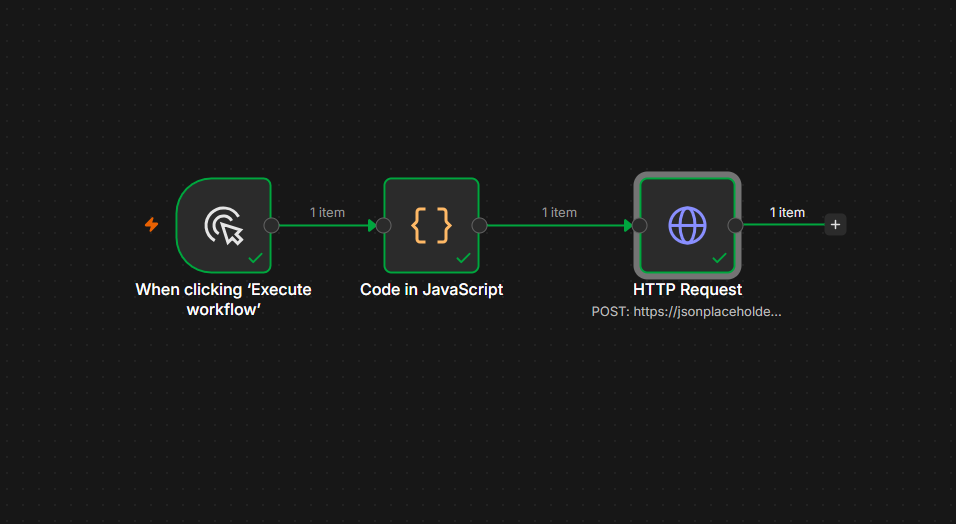

# 09 — HTTP Request Node (POST with headers/body)

## ⚠️ Before you look at workflow.json
Try building this yourself first from the instructions below. Only open `workflow.json` afterward to verify.

## Goal
Learn to *send* data to an API (POST) with a JSON body and custom headers — the pattern used for the majority of real paid API integrations (creating records, sending messages, etc).

## Concepts covered
- HTTP Request node in POST mode
- Setting Body Content Type to JSON and sending the full item as the payload
- Adding custom headers (e.g. `Content-Type: application/json`)
- Understanding that this is a mock API (jsonplaceholder) — it always echoes back `id: 101` for any new post, regardless of what you send

## Workflow structure
```
Manual Trigger → Code (build payload) → HTTP Request (POST)
```

## Code node content
```javascript
return [
  { json: { title: "My test post", body: "Hello from n8n", userId: 1 } }
];
```

## HTTP Request node settings
- Method: `POST`
- URL: `https://jsonplaceholder.typicode.com/posts`
- Body Content Type: `JSON`
- Body: `{{ $json }}` (sends the whole item as the request body)
- Headers: `Content-Type: application/json`

## Expected output
```json
{
  "title": "My test post",
  "body": "Hello from n8n",
  "userId": 1,
  "id": 101
}
```

## Screenshot


## What I learned / notes
- POST requests need a body — GET requests don't
- `{{ $json }}` sends the entire current item as the payload, useful when the item's shape already matches what the API expects
- jsonplaceholder is a fake/test API — it doesn't actually save anything, but always responds as if it did, which makes it perfect for practicing without real consequences

## Status
✅ Completed — response included echoed fields + `id: 101` — [Date: 7 July 2026]
