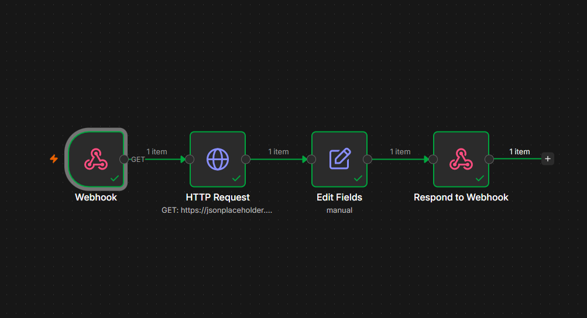

# 10 — Combined Mini-API (Webhook → HTTP Request → Respond)

## ⚠️ Before you look at workflow.json
Try building this yourself first from the instructions below. Only open `workflow.json` afterward to verify.

## Goal
Chain workflows 7, 8, and 9 together into one real, working mini-API: receive a request, fetch external data, respond with a result. This is the shape of a huge number of real freelance "connect two systems" jobs.

## Concepts covered
- Combining a Webhook trigger with an HTTP Request node in the same flow
- Enriching an incoming request with external data before responding
- Full request/response lifecycle in one workflow: receive → process/fetch → respond

## Workflow structure
```
Webhook (GET /user-info) → HTTP Request (GET user data) → Edit Fields (build result) → Respond to Webhook
```

## Webhook node settings
- HTTP Method: `GET`
- Path: `user-info`
- Respond: `Using 'Respond to Webhook' Node`

## HTTP Request node settings
- Method: `GET`
- URL: `https://jsonplaceholder.typicode.com/users/1`

## Edit Fields expression
```
{{ $json.name }} ({{ $json.email }}) works at {{ $json.company.name }}
```

## Respond to Webhook node settings
- Mode: `First Incoming Item`

## Expected output
Visiting the Test URL returns:
```json
{ "result": "Leanne Graham (Sincere@april.biz) works at Romaguera-Crona" }
```

## Screenshot


## What I learned / notes
- This is the general shape of a real API endpoint built in n8n: trigger → fetch/process → respond
- In a real project, the HTTP Request URL would often use data from the incoming webhook request (e.g. a user ID from a query parameter) instead of being hardcoded — that's a natural next step once query params are introduced
- Wraps up Day 4 (Webhooks & HTTP) — this workflow is a genuine remix of everything from 07, 08, and 09

## Status
✅ Completed — full chain executed cleanly, correct response returned — [Date: 8 July 2026]
