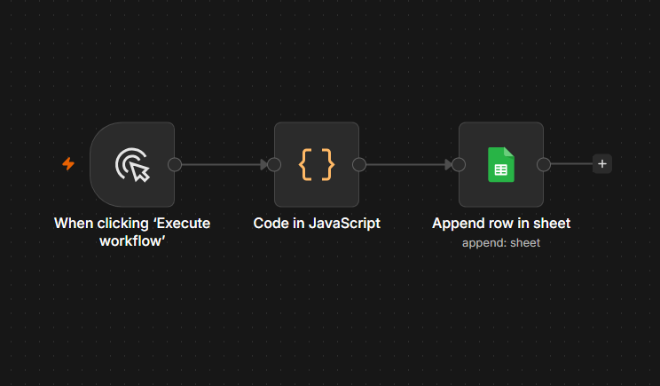

# 11 — Google Sheets: Append a Row (OAuth2 Integration)

## ⚠️ Before you look at workflow.json
Try building this yourself first from the instructions below. Only open `workflow.json` afterward to verify.

## Goal
Learn to write data into an external service using a **native integration node** (Google Sheets) instead of raw HTTP Request — and set up OAuth2 credentials for the first time.

## Concepts covered
- OAuth2 credential setup (one-time authorization flow)
- Google Sheets node — `Append Row` operation
- Mapping workflow fields to spreadsheet columns
- Why dedicated integration nodes exist: they wrap complex auth (token refresh, scopes) so you don't hand-build it with HTTP Request

## Workflow structure
```
Manual Trigger → Code (build fake lead data) → Google Sheets (Append Row)
```

## Code node content
```javascript
return [
  { json: { name: "Ali Khan", email: "ali@example.com", date: "2026-07-08" } }
];
```

## Google Sheets node settings
- Credential: Google OAuth2 (your account)
- Operation: `Append Row`
- Document: `n8n Practice`
- Sheet: `Sheet1`
- Column mapping: `name`, `email`, `date` → matching sheet headers

## Expected result
A new row appears in the actual Google Sheet:

| name | email | date |
|------|-------|------|
| Ali Khan | ali@example.com | 2026-07-08 |

## Screenshot


## What I learned / notes
- OAuth2 setup is a one-time step per account — once authorized, every Google Sheets/Gmail/Drive node can reuse the same credential
- Native nodes like this exist specifically to avoid manually handling API auth tokens
- This is the "quick database" pattern most non-technical clients are comfortable with — no need to set up a real database for small automations

## Status
✅ Completed — row appeared correctly in sheet — [Date: 8 July 2026]
