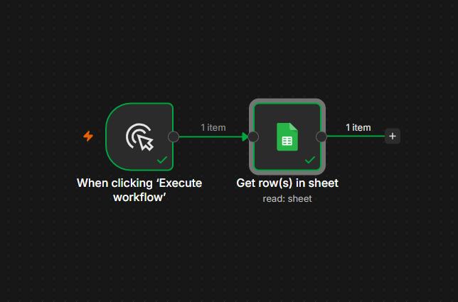

# 12 — Google Sheets: Read/Lookup a Row

## ⚠️ Before you look at workflow.json
Try building this yourself first from the instructions below. Only open `workflow.json` afterward to verify.

## Goal
Learn to query/read data back from a sheet — the counterpart to writing (workflow 11). Real automations almost always need both directions: write new data, and check existing data before acting.

## Concepts covered
- Google Sheets node — `Get Row(s)` operation
- Filtering rows by a specific column value (e.g. lookup by email) instead of pulling the entire sheet
- Why filtered lookups matter: they're the foundation of "does this record already exist?" logic used before IF-node branching later

## Workflow structure
```
Manual Trigger → Google Sheets (Get Row(s), filtered by email)
```

## Google Sheets node settings
- Credential: same Google OAuth2 credential as workflow 11
- Operation: `Get Row(s)`
- Document: `n8n Practice`
- Sheet: `Sheet1`
- Filter: `email` = `ali@example.com`

## Expected output
```json
{
  "name": "Ali Khan",
  "email": "ali@example.com",
  "date": "2026-07-08"
}
```
*(the exact row written in workflow 11)*

## Screenshot


## What I learned / notes
- Filtering at the node level is more efficient than pulling everything and filtering later with an IF node
- Filtering by a value that doesn't exist returns an empty result rather than an error — useful to know before building "if not found, create new row" logic
- This node depends directly on workflow 11 having successfully written the data first — a good example of workflows building on each other, not just existing in isolation

## Status
✅ Completed — returned Ali Khan's row correctly — [Date: 8 July 2026]
